# HCI 104497 : Home Automation Mobile Application. #
# Phase3: Second Iteration Final #
### Project Members ###
StdID | Name
------------ | -------------
**62621** | **Syed Anas Ali**
62354 | Ali Hunain

## Need Finding ##
- All the designs and the thoughts gathered together and now we are heading towards our final design and we are going to implement it in our application.

## Design Alternative ##

### Design Alternative 1 ###
- At initial we want a simple static design layout for our application to make user understand each and every option easily adn we thought to have simple color combinations that looks very decent.
  
### Design Alternative 2 ###
- After that we found our first design not that much attractive so we decided to remove static pictures and add slider so that it gives more attraction to the application.
  
### Design Alternative 3 ###
- All of the application options are displayed in form of bar which will be on the center of the screen of the mobile.

### Design Alternative 4 ###
- Since diplaying option in a bar isn't that much attractive and user may not be able to find the options quickly so we decided to show them in forms of cube each option have its own cide in front of the screen and all of the features display in front of the user.

### Design Alternative 5 ###
- Moving towards all the final phase all the designs are compiled and we evaluated them personally as well as done by our family members.

### Design Alternative 6 ###
- We uses the concept of **Flexiblity** because we don't want our design to be complicated so that user can't find their required option that's why we design a simple and easy designs for our application.

## Personas ##

1. ### Persona 1. Mobile Users ###

2. ### Persona 2. Family Members ###

3. ### Persona 3. Office Employee ###

4. ### Persona 4. Home Cleaners ###

Personas | Details | Goals
------------ | ------------- | -------------
Mr.Ahmed | He is mobile user and wants to have such appplication| He wants to control all of the appliances of his house by himself
		  
Personas | Details | Goals
------------ | ------------- | -------------
Kiran | She is a family girl | She wants to have full control on her house because she is the boss and obviously a working hand of her family
		    
Personas | Details | Goals
------------ | ------------- | -------------
Sehar | She is office employee | She wanted to take care of her house while she's away from it so that she can manages her expenses.

Personas | Details | Goals
------------ | ------------- | -------------
Ali Hunain | He is house care taker  | His boss wants that no extra billing should be done so he wants this application badly.
 

## Scenerios ##

###  Scenerio one ###
- User wants to save extra billing.

### 2. Scenerio Two ###
- User wants a professional way to control appliances.

### Scenerio Three ###
- User wants to get rid of doing things physically.

### Scenerio Four ###
- User Wants to save his/her time by doing all things digitally.

## Storyboard ##

### Storyboarding 1 ###
- User is very desperate of this over billing and wants something that can give him control so that he/she can beer other expenses.

### Storyboarding 2 ###
- if Kiran forgets to turn off the lights of the house so she can easily done this by using our application.

### Storyboarding 3 ###
- Suppose if sehar wants her room to be cool when she arrives in hot weather so she can done this easily by just opening AC from our application.

### Storyboarding 4 ###
- Ali Hunain forgets to switch off the oven and the boss just arrived she he can easily pull things by shut down the oven using this amazing application.

## Finalize Prototypes ##

Welcome Screen

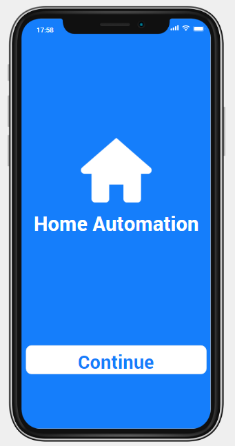

Home Screen

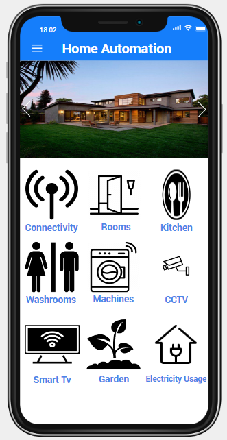

Connectivity

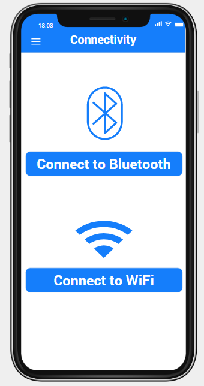

Rooms Controls

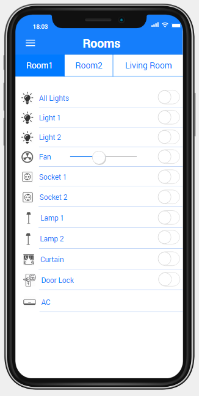

Kitchen Appliences Control

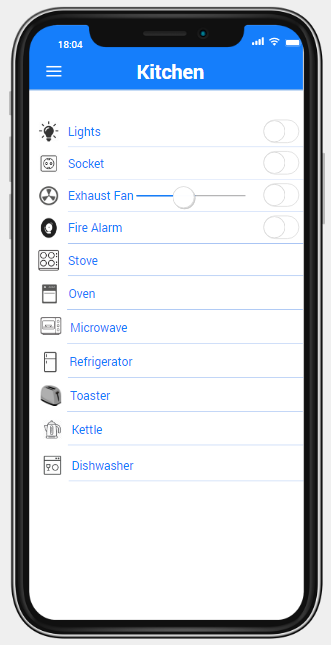

Washrooms

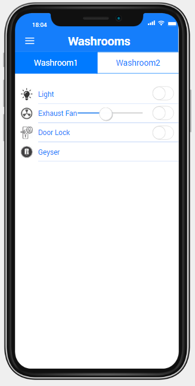

Water Machine

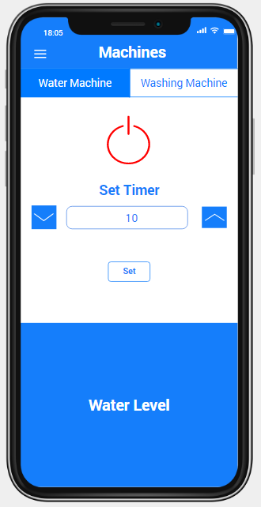

Washing Machine

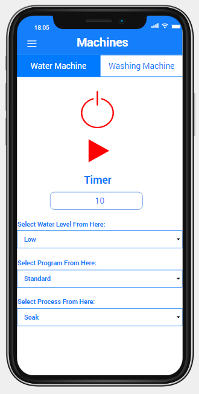

CCTV

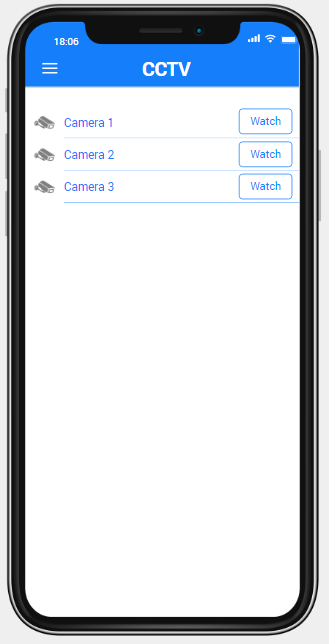

Smart TV

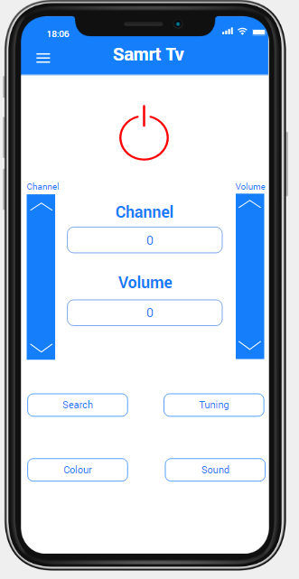

Garden Controls

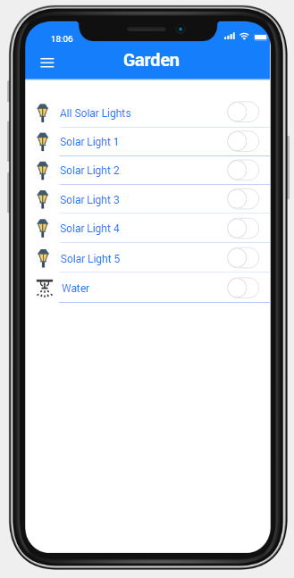

Electricity Usage

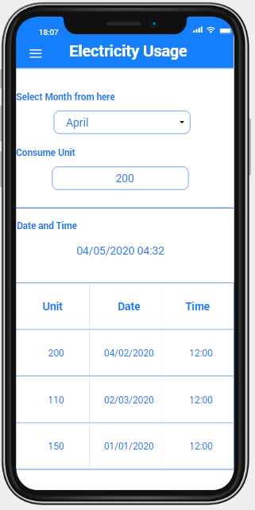

